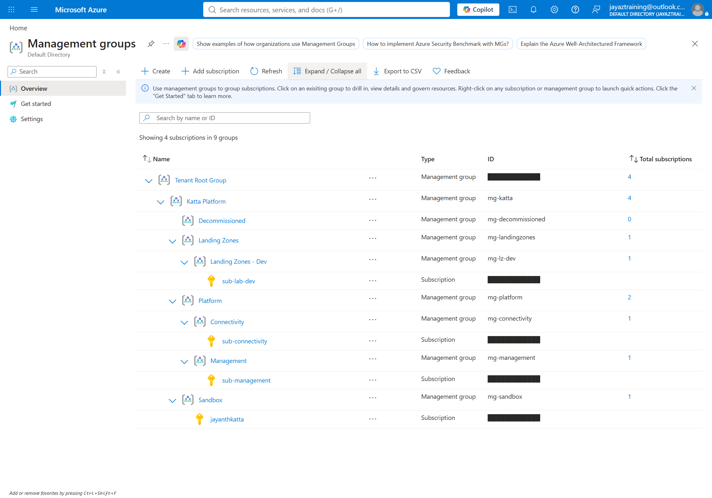
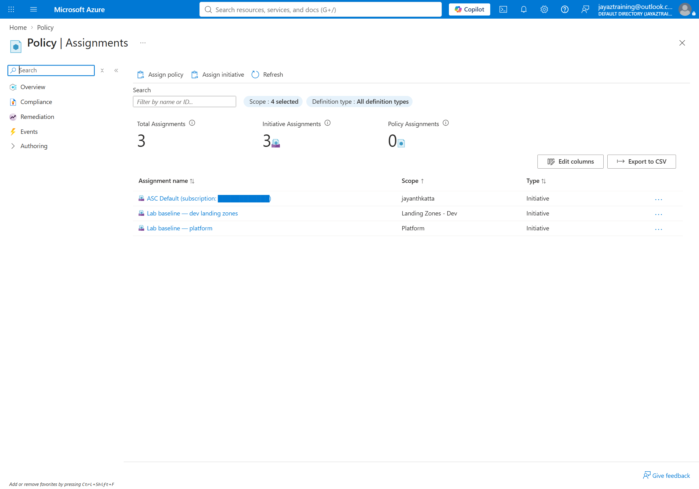
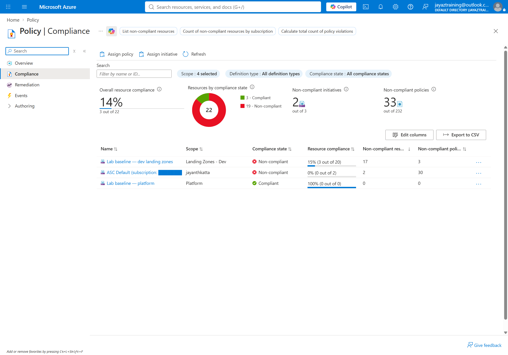

# Week 01 — The landing zone, deployed

A management group tree is a diagram until something is assigned to it. This
week makes it govern, and proves it by getting a deployment denied.

## Cost note

**$0.** Azure Policy definitions, assignments and compliance evaluation are free
at any scale. The test bed is a virtual network, a subnet and two network
interfaces, all created and destroyed within the session — under a penny in
total. Nothing runs continuously and nothing is left up.

`scripts/cleanup.sh` removes everything, including the parts that do not live in
a resource group. See **Teardown** below, which is the most useful thing in this
week.

## What gets built

| | |
| --- | --- |
| Custom definition | `deny-public-ip-on-nic`, defined at `mg-katta` |
| Initiative | `initiative-lab-baseline` — allowed locations, required tag, no public IP |
| Assignments | At `mg-lz-dev` (staged) and `mg-platform` (always enforcing) |
| Test bed | `rg-wk01-landing-zone-dev-scus-001` — a VNet and a subnet |

Three scopes are in play and they are deliberately different:

- The **definition** is created at `mg-katta`. A definition can only be assigned
  at or below where it is defined, so putting it at the intermediate root makes
  it usable by every tier and invisible outside the lab.
- The **assignments** target `mg-lz-dev` and `mg-platform`. Neither ever names a
  subscription. Any subscription placed under those groups later is governed
  automatically, including ones that do not exist yet — that inheritance is the
  entire reason the tree exists.
- The **test bed** is a resource group, because that is the only scope whose
  deletion is atomic and complete.

## The hierarchy this governs



Four subscriptions in nine groups. The baseline is assigned at **Landing Zones -
Dev** and at **Platform** — never at a subscription, and never at Tenant Root
Group.



Both assignments are initiatives at management group scope. Neither one names a
subscription anywhere.

## What compliance actually reported



Measured 2026-08-22, after a forced scan:

| | |
| --- | --- |
| Lab baseline — dev landing zones | **Non-compliant**, 15% (3 of 20), 17 non-compliant resources across 3 policies |
| Lab baseline — platform | Compliant, 100% (0 of 0) — nothing has been deployed there yet |

Two things worth reading off that.

**Those 17 non-compliant resources were created while the assignment was in
report-only mode, and switching to enforcing did not remove a single one.**
Policy evaluates on write. Enforcing blocks the *next* deployment; it has no
opinion about what is already there. Cleaning up existing violations is
remediation, which is a different mechanism and a later week.

**"100% (0 of 0)" on the platform row is not a pass.** It is what an assignment
reports when it has never evaluated anything. A green tick against an empty
scope looks identical to a green tick against a clean one, and only the
denominator tells them apart.

## The custom rule

```
Microsoft.Network/networkInterfaces/ipConfigurations[*].publicIpAddress.id
```

The `[*]` matters. A NIC can carry several IP configurations, and an alias
without the wildcard would inspect only the first — passing a NIC whose *second*
configuration is public. With `[*]`, the condition is true if any configuration
has one.

The effect is a **parameter**, not a constant, which is what allows the same
definition to be assigned in reporting mode and enforcing mode without editing
it.

## Run it in two stages

```bash
./scripts/deploy.sh report
```

Assigns with `enforce = false` — Azure's `DoNotEnforce` mode. The assignment
evaluates and reports compliance but blocks nothing. This is how a guardrail is
introduced to an environment that already has resources in it: you find out what
*would* have been blocked before anything actually is.

```bash
./scripts/validate.sh
```

Three attempts: a NIC with a public IP, a resource in a banned region, and the
compliant equivalent. In reporting mode all three succeed, and the first two
show as non-compliant.

```bash
./scripts/deploy.sh enforce
./scripts/validate.sh
```

Same assignment, `enforce = true`. Now the first two are rejected with
`RequestDisallowedByPolicy` — and the third still deploys.

`validate.sh` adjusts what it expects to the stage that is deployed, so a pass
means the policy is behaving correctly *for that stage*, not that everything was
blocked. Read the next section before concluding a deny is broken.

That third case is not padding. A rule that only ever blocks has been shown to
be *on*, not to be *correct*. Proving the compliant path still works is the
difference between a guardrail and an outage.

## What the error actually says

The assignment carries a `non_compliance_message`. Without one, a developer gets
a policy GUID and a definition ID. With one, they get a sentence telling them
what to do instead. That string is the entire developer experience of a
guardrail, and it costs one line.

## Scope is the first thing to check when a deny does not fire

A policy assigned at a management group governs the subscriptions **under** that
management group. Nothing else. That sounds too obvious to write down, and it is
exactly what went wrong the first time this week was deployed.

The assignment at `mg-lz-dev` was live, `enforcementMode` read `Default`, the
effect read `Deny`, and non-compliant deployments kept succeeding. Every property
of the assignment was correct. The subscription simply was not under
`mg-lz-dev` — it had been created but never placed, so it still sat at Tenant
Root Group, outside everything the assignment could reach.

The tell is in the portal's management group view: the subscription count column
showed **0** against Landing Zones - Dev while the subscription was plainly
visible higher up the page, listed directly under the tenant root.

Check, in this order, before suspecting anything subtler:

```bash
# 1. Is the subscription actually under the governed management group?
az account management-group show --name mg-katta --expand --recurse

# 2. Is the assignment there, and enforcing?
az policy assignment show --name assign-baseline-lz-dev   --scope /providers/Microsoft.Management/managementGroups/mg-lz-dev
```

Step 1 first. An assignment is easy to inspect and looks convincing, which is
what makes it a bad place to start — every field can be right while the policy
governs nothing at all.

Creating a subscription and placing it in the hierarchy are **two separate
operations**. The Subscription Alias API creates it at the tenant root; moving it
is a second call. A subscription that exists but has never been placed inherits
no policy and no role assignments, and it looks completely healthy until
something is supposed to stop you and does not.

## Microsoft.PolicyInsights has to be registered, and forgetting it is silent

Policy **evaluates and denies** perfectly well without it — enforcement happens
in Azure Resource Manager, not in that provider. So the guardrail works, the
deny fires, and nothing looks wrong.

What breaks is reading the results back. `az policy state trigger-scan` fails
with `SubscriptionNotRegistered`, and the portal reports the assignment as
**"100% (0 out of 0)"** — which reads as *compliant* when it actually means
*never evaluated*. A green tick for a policy that has never looked at anything
is the most misleading state in this whole week.

`deploy.sh` registers it alongside Microsoft.Network and Microsoft.Storage.

## Compliance data is not immediate

Policy evaluates on resource write straight away — that is why the deny is
instant. Everything else is scheduled, and the intervals differ:

| Trigger | Interval |
| --- | --- |
| New or updated assignment applied to its scope | ~5 minutes |
| A resource deployed or changed | ~15 minutes |
| A subscription created or moved in the hierarchy | ~30 minutes |
| Standard sweep of everything else | every 24 hours |

Verified against Microsoft Learn on 2026-08-22. An empty compliance report right
after an apply means "not scanned yet", not "compliant". To force it:

```bash
az policy state trigger-scan --resource-group rg-wk01-landing-zone-dev-scus-001
```

## Teardown — the part worth reading

```bash
./scripts/cleanup.sh
```

**Deleting the resource group is not enough this week.** The assignments, the
initiative and the definition all live at management group scope, outside every
resource group, in a part of the hierarchy that resource-group deletion cannot
reach.

Delete the group by hand and the guardrails remain — still evaluating, still
denying — with nothing left in the subscription to explain where they came from.
An orphaned deny assignment whose source nobody can find is a genuinely nasty
thing to inherit.

`terraform destroy` removes both because Terraform tracks both, and cleanup.sh
verifies afterwards that the assignment is actually gone rather than assuming it.

## Prerequisites

- `sub-lab-dev` must exist, and `terraform.tfvars` must point at it.
- The HCP workspace `azure-week-01-dev` runs in **local execution**, so it
  authenticates with your `az login` session. A new workspace defaults to remote
  execution and must be switched, or the plan fails with no Azure credentials.
- Federated credentials are only needed once runs move to remote execution. They
  are not a prerequisite for deploying this week.
