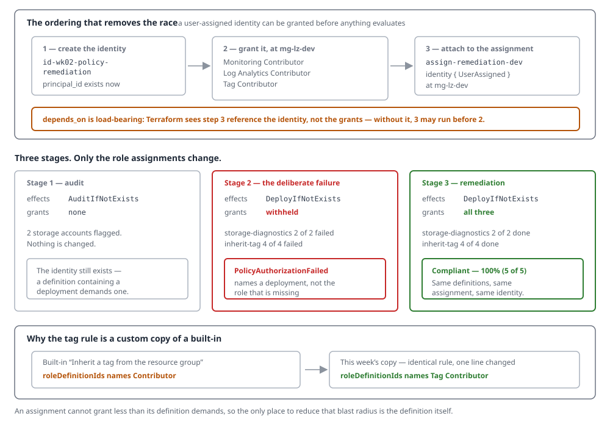
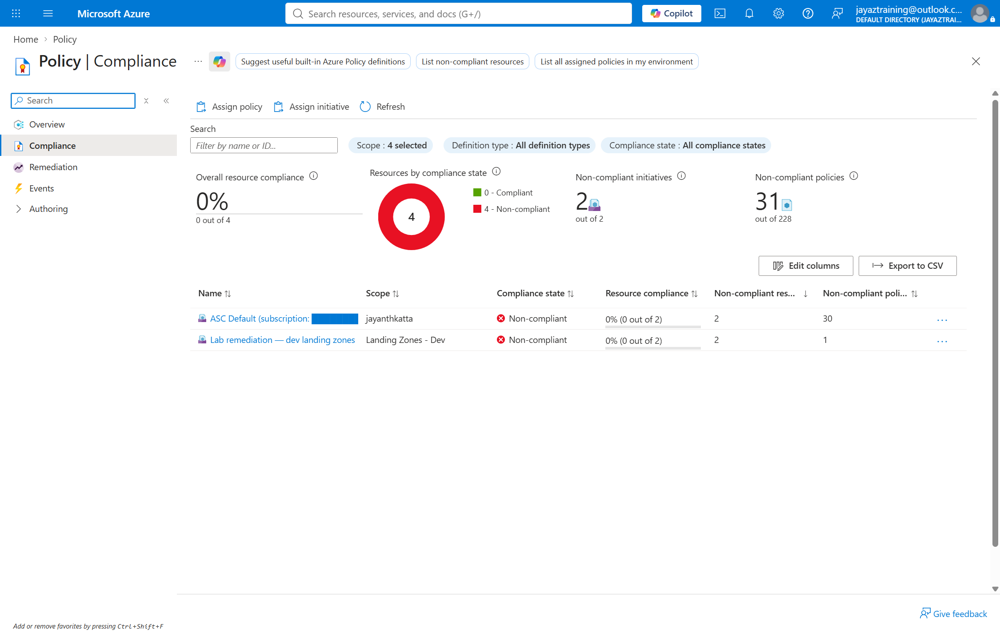
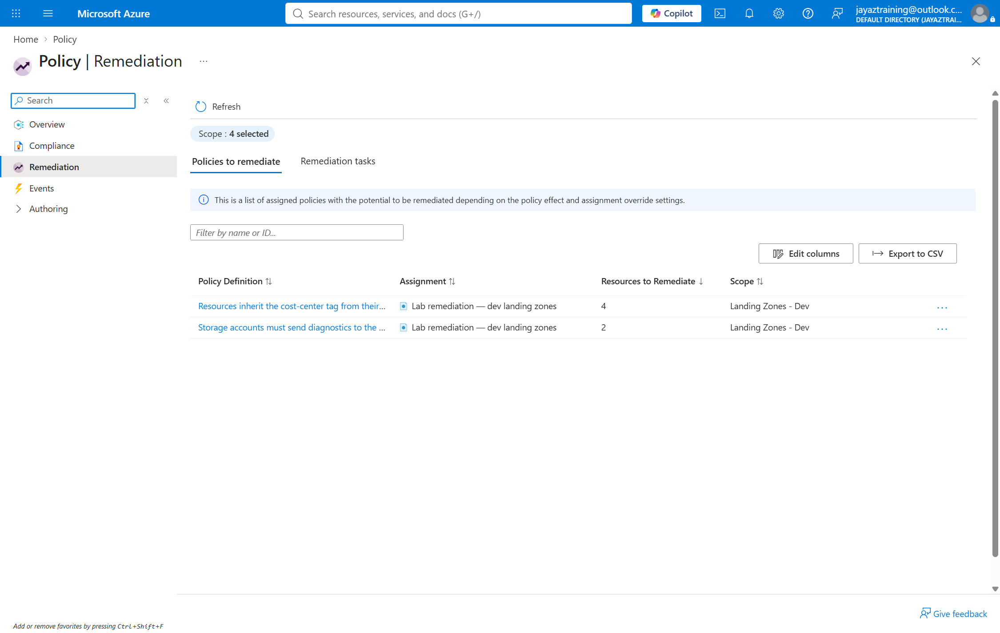
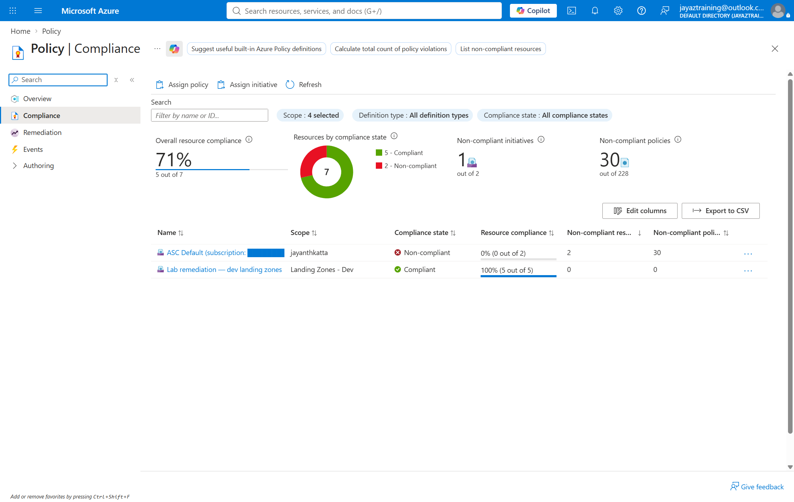

# Week 02 — Policy as code

Week 01 proved a `deny`. A deny governs the next deployment and nothing else —
it is a gate, and gates do not fix what is already inside. This week is the
other half: policy that reaches into an estate that already exists and changes
it, which means a managed identity, which means a role assignment, which is
where this stops being about policy and starts being about access.

## Cost note

**Under $1.** Policy definitions, assignments, compliance evaluation and
remediation tasks are free at any scale. The test bed is a Log Analytics
workspace and two Standard LRS storage accounts, up for a few hours: the
workspace ingests a few MB of storage metrics against a 5 GB/month free
allocation, and the storage accounts hold nothing. Retention is left at the
30-day free floor, because retention beyond it is the part of Log Analytics
that bills.

`scripts/cleanup.sh` removes everything, including the three role assignments
at management group scope that survive deletion of the resource group. See
**Teardown**.

## What gets built

| | |
| --- | --- |
| `deployIfNotExists` definition | `dine-storage-diagnostics-to-law` — any storage account without a diagnostic setting pointing at the lab workspace gets one deployed |
| `modify` definition | `modify-inherit-tag-from-rg` — resources inherit `cost-center` from their resource group |
| Initiative | `initiative-lab-remediation`, both rules, defined at `mg-katta` |
| Assignment | `assign-remediation-dev` at `mg-lz-dev`, carrying a user-assigned identity |
| Identity | `id-wk02-policy-remediation`, granted three roles at `mg-lz-dev` |
| Test bed | `rg-wk02-policy-as-code-dev-scus-001` — a workspace and two deliberately non-compliant storage accounts |

## How it fits together



## The design decision: user-assigned, not system-assigned

A policy assignment holds exactly one managed identity either way, so this is
not a question of how many. It is a question of ordering.

A **system-assigned** identity does not exist until the assignment that owns it
exists. Its principal ID cannot be known before then, so the role assignment can
only be created afterwards — and Azure begins evaluating the assignment the
moment it is created. The window between "the assignment exists" and "its
identity can do anything" is real, and every remediation that starts inside it
fails. It is also fragile across changes: replace the assignment and every grant
attached to the old principal is orphaned, pointing at an object ID that no
longer resolves.

A **user-assigned** identity inverts that. Create the identity, grant it, then
hand it to the assignment:

```hcl
resource "azurerm_user_assigned_identity" "remediation" { ... }

resource "azurerm_role_assignment" "remediation" {
  for_each     = var.grant_remediation_roles ? local.roles : {}
  scope        = var.lz_dev_management_group_id
  principal_id = azurerm_user_assigned_identity.remediation.principal_id
}

resource "azurerm_management_group_policy_assignment" "dev" {
  identity {
    type         = "UserAssigned"
    identity_ids = [azurerm_user_assigned_identity.remediation.id]
  }
  depends_on = [azurerm_role_assignment.remediation]
}
```

The `depends_on` is not decoration. Terraform sees the assignment reference the
identity, not the grants, so without it the assignment is free to be created
first — reintroducing exactly the race that user-assigned was chosen to remove.

## Three roles, and why one of them is not Contributor

The identity holds three grants at `mg-lz-dev` — the same scope the initiative
is assigned at, so the identity can reach everything the assignment governs and
nothing else:

| Role | For |
| --- | --- |
| Monitoring Contributor | Writing the diagnostic setting on the storage account |
| Log Analytics Contributor | Writing to the workspace that setting points at |
| Tag Contributor | Writing the inherited tag |

The first two are not interchangeable: one grants the write on the source, the
other on the destination, and dropping either produces a remediation that fails
on the half you did not grant.

The third is the interesting one. Azure ships a built-in that does exactly what
`modify-inherit-tag-from-rg` does — `Inherit a tag from the resource group if
missing`, `ea3f2387-9b95-492a-a190-fcdc54f7b070` — and its `roleDefinitionIds`
names **Contributor**. Assigning the built-in therefore means granting
Contributor over every subscription under `mg-lz-dev`, permanently, in order to
write a tag.

The definition is what decides how much power the identity needs, and an
assignment cannot grant less than the definition demands. So this week writes
its own copy of the rule, identical except for one line:

```json
"roleDefinitionIds": [
  "/providers/Microsoft.Authorization/roleDefinitions/4a9ae827-6dc8-4573-8ac7-8239d42aa03f"
]
```

Tag Contributor. Write tags, nothing else. That is the entire reason the custom
definition exists, and it is the kind of choice that is only available at the
definition.

## Three stages

```
./scripts/deploy.sh audit       auditIfNotExists, tag rule Disabled, no grants
./scripts/deploy.sh no-grants   deployIfNotExists — with an identity holding nothing
./scripts/deploy.sh remediate   the same, with the three grants in place
```

The middle stage is run on purpose and is expected to fail. It is the most
common real failure of `deployIfNotExists`, and the error it produces does not
mention the missing role assignment.

## Stage 1 — audit



Measured 2026-08-25, after a forced scan of the week's resource group:

| | |
| --- | --- |
| Lab remediation — dev landing zones | **Non-compliant**, 0% (0 of 2) |
| `storage-diagnostics` | 2 non-compliant storage accounts |
| `inherit-tag` | not evaluated — the rule is `Disabled` at this stage |
| Resources changed | none |

Two things this stage settled that the design had wrong.

**The assignment carries an identity even here.** The first attempt attached one
only in the remediation stages, and Azure refused the assignment outright:

```
ResourceIdentityRequired: Policy assignments must include a 'managed identity'
when assigning 'DeployIfNotExists' policy definitions or policy definitions that
contain a deployment in the effect details.
```

The requirement is on what the *definition can do*, not on the effect the
assignment selected. So an audit-only assignment of a `deployIfNotExists`
definition still holds an identity — and what makes an identity dangerous is
therefore not its presence but its role assignments. The audit stage runs with
zero grants, which is the honest way to make it inert.

**`modify` has no audit counterpart.** Its allowed effects are `Modify` and
`Disabled`, so there is no way to preview it the way `auditIfNotExists` previews
a deployment. This stage runs it `Disabled`, and the answer to "how many
resources are missing the tag" only arrives when the rule is switched on.

## Stage 2 — the deliberate failure



Effects switched to `DeployIfNotExists` and `Modify`, identity attached, and the
three role assignments deliberately withheld. Both remediation tasks failed:

| Task | Deployments | Succeeded | Failed |
| --- | --- | --- | --- |
| `storage-diagnostics` | 2 | 0 | 2 |
| `inherit-tag` | 4 | 0 | 4 |

Four, not two, for the tag rule — the workspace and the remediation identity
itself are resources in the group, and they are missing the tag exactly as the
storage accounts are. A policy at management group scope does not exempt the
lab's own machinery from itself.

The two errors are worth reading side by side, because only one of them tells
you what is wrong.

`modify` names the missing permission and the principal:

```
The 'PATCH' request failed with status code: 'Forbidden'. Inner Error: 'The
client '…' with object id '…' does not have authorization to perform action
'Microsoft.Resources/tags/write' over scope '…/providers/Microsoft.Resources/
tags/default' or the scope is invalid.
```

`deployIfNotExists` says only that something is missing:

```
Evaluation of DeployIfNotExists policy was unsuccessful. The policy assignment
'…/assign-remediation-dev' resource identity does not have the necessary
permissions to create deployment '…/PolicyDeployment_12003642577558566238'.
```

Not which permission, not at which scope, not which of the two roles is absent.
That is the error this stage exists to produce: it points at a deployment name,
so it gets debugged as a deployment problem, and the actual fault is a role
assignment that was never made.

One measurement about the task API rather than about policy: the task's own
`provisioningState` reached `Failed` while `successfulDeployments` and
`failedDeployments` were both still `0`. Read at that instant it says "failed
without attempting anything", which is not what happened — the counters fill in
afterwards. `validate.sh` now settles before counting.

## Stage 3 — remediation with the grants in place



Nothing changed except the three role assignments. Same definitions, same
initiative, same assignment, same identity — the identity could now act:

| Task | Resources | Succeeded | Failed |
| --- | --- | --- | --- |
| `remediate-storage-diagnostics-153605` | 2 | 2 | 0 |
| `remediate-inherit-tag-153616` | 4 | 4 | 0 |

Read back from the resources rather than from the tasks:

```
stwk02a…  diag-to-law -> law-wk02-dev-scus-001   cost-center=platform-lab
stwk02b…  diag-to-law -> law-wk02-dev-scus-001   cost-center=platform-lab
law-wk02-dev-scus-001                            cost-center=platform-lab
id-wk02-policy-remediation                       cost-center=platform-lab
```

And the assignment's own compliance, after a forced re-scan:
**Compliant, 100% (5 of 5), 0 non-compliant resources.**

### Two things this stage taught that the docs do not

**One remediation per assignment, per definition reference, per scope, at a
time.** A second request is refused with `InvalidCreateRemediationRequest`, and
the message names the task already running:

```
The following remediations: 'remediate-storage-diagnostics-153605' are already
running for policy assignment '…/assign-remediation-dev', definition reference
ID 'storage-diagnostics' on a scope conflicting with requested scope.
```

That refusal is not a failure to remediate — the work is in flight under another
name, and the task named in the error went on to succeed. A script that reports
the refusal as an error reports FAILED over a remediation that worked, so
`validate.sh` now parses the running task's name out of the message and attaches
to it. Anything that can run the week twice at once — two terminals, a rerun
while the first is still scanning — will hit this.

**The tag rule remediated four resources, not two.** The workspace and the
remediation identity are resources in the group, and they were missing the tag
exactly as the storage accounts were. A policy assigned at management group
scope does not exempt the lab's own machinery from itself — which is the correct
behaviour and worth seeing once, because it is also what makes a badly scoped
`modify` rule rewrite things you did not have in mind.

## Teardown

Three kinds of thing were created and only one of them dies with the resource
group:

- **In the group** — the workspace, the storage accounts, the identity, and the
  diagnostic settings the policy itself deployed
- **On the tree** — the two definitions, the initiative, the assignment
- **On the tree** — three role assignments granted to the identity

The role assignments are the ones to watch. Deleting the resource group deletes
the managed identity, but a grant naming a principal ID that no longer resolves
is still a standing role assignment — the portal renders it as "Identity not
found". They look harmless and they accumulate: every re-run of this week would
leave three more. `scripts/cleanup.sh` deletes the group, destroys everything on
the tree, and then checks by principal ID that no grant survived.

Run for real on 2026-08-25: resource group deleted, 7 objects destroyed
(assignment, initiative, two definitions, three role assignments), and verified
against Azure afterwards — `sub-lab-dev` holds only the Azure-managed
`NetworkWatcherRG`, `mg-lz-dev` carries no policy assignment, and the identity
has 0 role assignments anywhere on the tree.

One thing does survive, deliberately: **remediation task records outlive the
assignment they ran against.** `az policy remediation list --management-group
mg-lz-dev` still returns every task from all three stages after teardown. They
are history rather than infrastructure, they cost nothing, and they are the only
remaining evidence of what ran — so `cleanup.sh` reports them instead of
deleting them silently.
