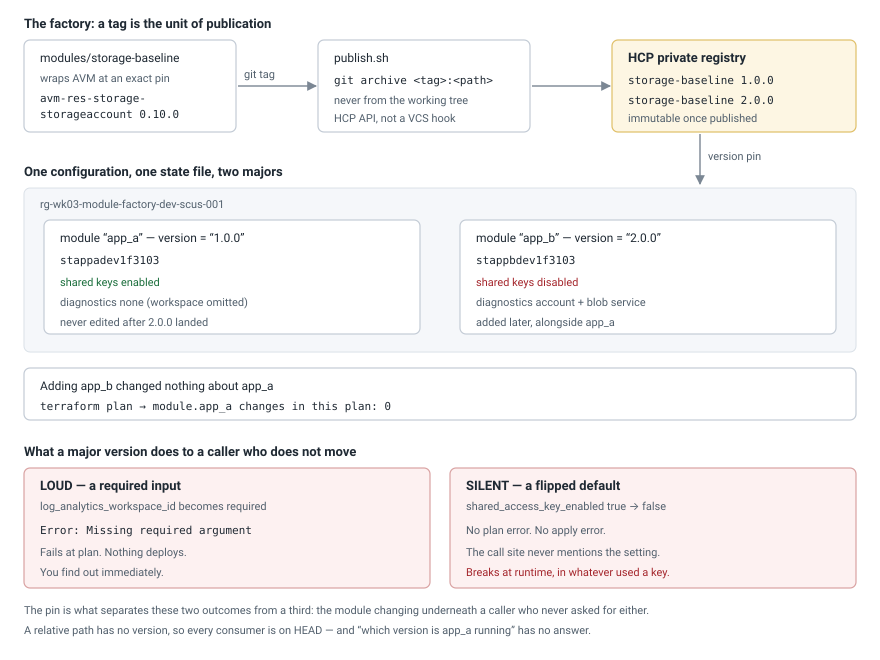
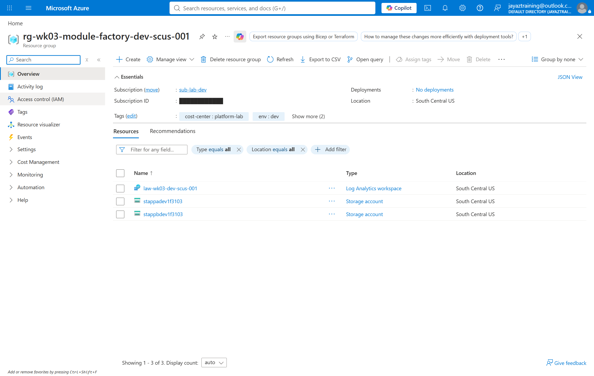
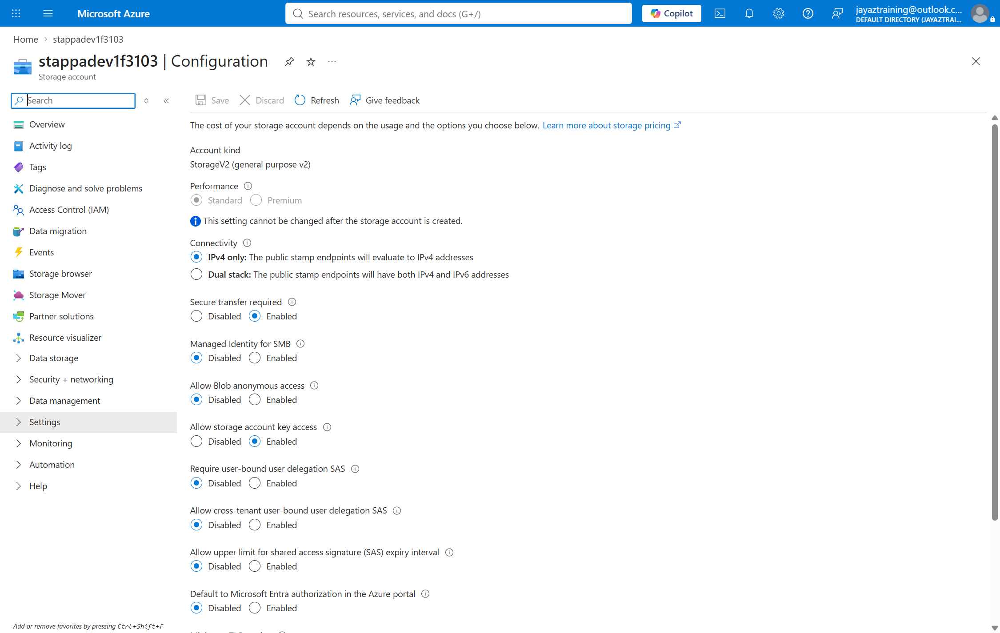
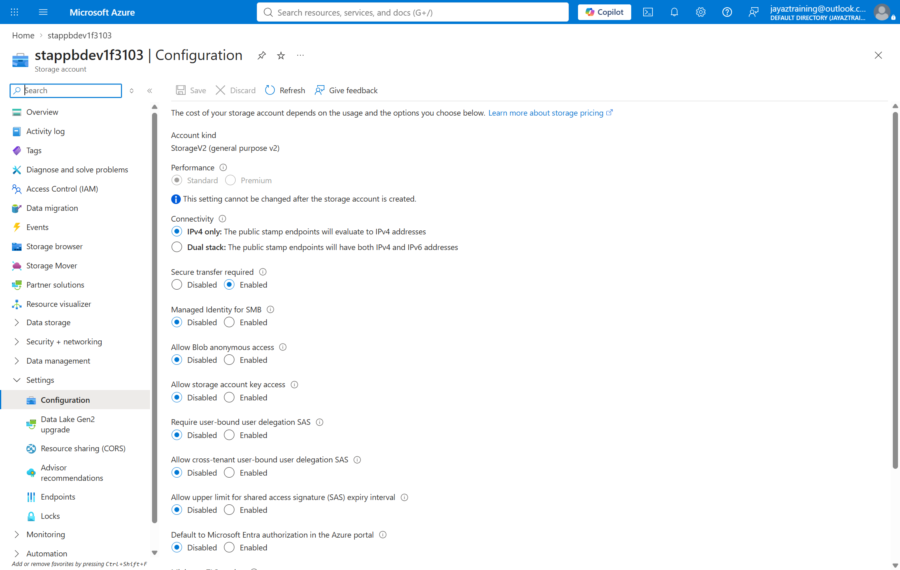

# Week 03 — A module factory on Azure Verified Modules

A private module registry, a golden module published to it by git tag, and two
consumers pinned to two different majors of that module in one state file.

The week's claim: **a private registry is not a convenience, it is what makes a
version pin mean something.** The proof is what happens to an existing consumer
when a breaking major lands beside it.

## Cost note

Deployed continuously while the week is up:

| Resource | SKU | What it costs at rest |
| --- | --- | --- |
| 2 × storage account | Standard LRS, StorageV2 | Billed per GB stored and per transaction. Both accounts hold one empty container |
| 1 × Log Analytics workspace | PerGB2018, 30-day retention | Billed per GB ingested. 30 days is the retention floor that carries no retention charge |

Nothing here has a per-hour price — no compute, no gateway, no firewall. The
bill is driven by data, and this week stores and ingests essentially none.

`scripts/cleanup.sh` deletes the whole resource group, which removes every
resource above. It deliberately **keeps** the published registry versions unless
given `--registry`: unpublishing a version breaks every configuration pinned to
it, which is the opposite of the property this week exists to demonstrate.

## How it fits together



## The design

### Consume AVM, wrap it in this lab's own module

`storage-baseline` creates nothing itself. Every resource comes from
`Azure/avm-res-storage-storageaccount/azurerm`, pinned to an exact `0.10.0`.
What the wrapper adds is everything AVM deliberately has no opinion about — AVM
ships a *correct* storage account, a platform team needs *their* storage
account, and the difference between those two is the wrapper.

A caller passes a workload word and gets back four things they would otherwise
get wrong: a name that is valid, unique and derivable; transport and public
access already at the lab's baseline; the `cost-center` tag the estate's tagging
policy enforces; and diagnostics wired up from a single workspace ID.

**The AVM pin is exact, and that is a different decision from the one a consumer
of this module makes.** A wrapper's job is to be the stable thing. On `~> 0.10`
a caller pinned to `storage-baseline` 1.0.0 could still have their storage
account change underneath them, which is precisely what pinning was supposed to
buy them. AVM is also pre-1.0, where a minor bump is permitted to break.

### Publishing is by tag, through the API

`publish.sh` builds the tarball with `git archive <tag>:<path>` — never from the
working tree. A registry version is immutable, so a tarball built from a dirty
checkout publishes a version that matches no commit, and the only correction
available is deleting a version other configurations may already be pinned to.

The API path rather than a VCS connection is what lets a monorepo publish one
subdirectory without splitting each module into its own repository.

### One workspace ID in, two diagnostic settings out

A storage account emits no logs of its own — only the `Transaction` metric. The
read, write and delete audit events belong to the blob *service*, a separate ARM
resource at `.../blobServices/default` with its own diagnostic setting. Asking
for `allLogs` on the account is accepted and produces nothing, which is a thing
discovered during an incident rather than during a deploy.

## The two kinds of breaking change

`storage-baseline` 2.0.0 carries one of each, deliberately:

| | Change | How it reaches you |
| --- | --- | --- |
| **Loud** | `log_analytics_workspace_id` becomes required | `Missing required argument`, at plan. Nothing deploys |
| **Silent** | `shared_access_key_enabled` defaults `true` → `false` | No plan error, no apply error. Whatever authenticated with a shared key stops working at runtime |

The silent one is what makes major versions worth the trouble. A constraint like
`~> 1.0` would have caught neither, because both changes are in a new major —
and a team that writes `~> 2.0` after upgrading has re-armed the silent one for
2.1.0.

## What was measured

Deployed to `sub-lab-dev`, both stages, then `scripts/validate.sh`:
**8 passed, 0 failed.**

| # | Check | Measured result |
| --- | --- | --- |
| 1 | Both versions published and usable | `1.0.0 ok`, `2.0.0 ok` |
| 2 | The baseline, on the deployed accounts | both `TLS1_2`, no public blob access, `cost-center=platform-lab` |
| 3 | The 1.0.0 consumer's diagnostics | 0 on the account, 0 on the blob service — 1.0.0 allowed the workspace to be omitted, so it was |
| 4 | The 2.0.0 consumer's diagnostics | 1 on the account (`Transaction`), 1 on the blob service (`audit`) |
| 5 | **The silent break** | `stappadev1f3103` (1.0.0) `allowSharedKeyAccess=True`; `stappbdev1f3103` (2.0.0) `False` |
| 6 | **The loud break** | the 1.0.0 consumer's exact inputs against 2.0.0: `Missing required argument` |
| 7 | Drift | none |

Two results are worth stating on their own.

**Adding the new major changed nothing about the old consumer.** The stage-v2
plan, read as JSON rather than eyeballed:

```
module.app_a changes in this plan: 0
```

Four resources created, all of them `module.app_b`. That is the property the pin
buys, and it is a claim about a *plan* — which is why `deploy.sh` saves the plan
and reports on it before applying, since after the apply the plan is gone.

**The silent break is only visible on deployed resources.** Both accounts were
created from the same module by the same code path, and neither call site
mentions `shared_access_key_enabled`. One permits shared keys and one does not,
and nothing in either configuration says so.

The control matters as much as the result: the identical inputs that fail
against 2.0.0 return `Success! The configuration is valid.` against 1.0.0. Same
file, same registry, one line different — so the difference is attributable to
the module version and to nothing else.

## Evidence

| | |
| --- | --- |
|  | The resource group: two storage accounts from one module at two majors, plus the workspace |
|  | `stappadev1f3103`, built from 1.0.0 — **Allow storage account key access: Enabled** |
|  | `stappbdev1f3103`, built from 2.0.0 — **Disabled**. Every other setting on the blade is identical |

## Running it

```bash
./scripts/publish.sh 1.0.0     # both versions must exist before either stage runs
./scripts/publish.sh 2.0.0
./scripts/deploy.sh v1         # one consumer, pinned to 1.0.0
./scripts/deploy.sh v2         # a second on 2.0.0, alongside the first
./scripts/validate.sh
./scripts/cleanup.sh
```

`count = 0` does not mean "not downloaded". `terraform init` resolves and
installs every module a configuration refers to before it evaluates what any
count is, so 2.0.0 has to exist in the registry before stage v1 can initialise
at all.

## Teardown

Two kinds of thing were created and only one of them should go.

- **The consumers** — the resource group, the workspace, the two storage
  accounts and the four diagnostic settings. They cost money and prove nothing
  further once the measurements are taken. Deleted.
- **The registry versions** — `storage-baseline` 1.0.0 and 2.0.0. **Kept.**

Keeping the versions is not laziness. They cost nothing, they are the week's
actual output, and deleting a published version is the one destructive act a
module registry does not forgive: every configuration pinned to it stops
initialising, including configurations owned by people who were never asked.
`scripts/cleanup.sh --registry` removes them, and the flag exists so that
removal is always a deliberate sentence someone typed.

There is an asymmetry worth noticing here. The Azure side of this week is
disposable and was designed to be. The registry side is not, because other
people's code can depend on it — which is the same property that made the pin
meaningful in the first place, seen from the publisher's end.

Run for real on 2026-09-03. `az group list` against `sub-lab-dev` afterwards
returns only `NetworkWatcherRG`, which Azure creates by itself in any
subscription where a virtual network has existed and which is not drift. The
registry was queried after the destroy: 1.0.0 and 2.0.0 both still present at
status `ok`.

## What this cost in surprises

- **`git archive <tag>:<path>` resolves the path relative to the current
  directory, and a miss returns an empty tree rather than an error.** Run from
  the week directory with a repo-root-relative path, it produced a valid
  45-byte tarball containing nothing, which uploaded with a 200 and reached
  status `ok`. Every signal said success; the published version was empty.
  `publish.sh` now anchors at the repo root and counts the files before
  uploading.
- **A version record without its upload is still a version.** A publish that
  failed after creating the record left 1.0.0 at status `pending`, and the retry
  was refused as "already exists, versions are immutable". It has to be deleted
  before republishing.
- **AVM nests deeply enough to hit Windows `MAX_PATH`.** The storage module
  pulls `avm-utl-interfaces` once per sub-resource, and the clone fails with
  `Filename too long` — with `core.longpaths=true` set *and* the
  `LongPathsEnabled` registry value already `0x1`. The module cache is
  relocatable and the configuration is not, so the scripts move `TF_DATA_DIR`.
- **`az` renders JSON booleans as `True`/`False`.** A comparison against
  lowercase `"false"` fails on a resource that is correct — the same class of
  bug as a check that passes because the lookup broke, inverted.
