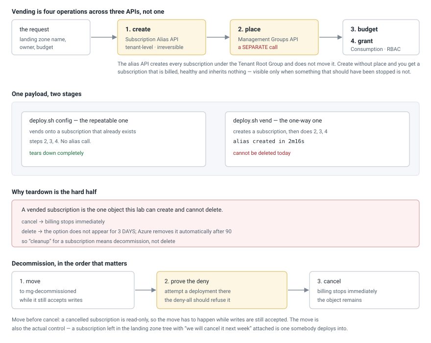
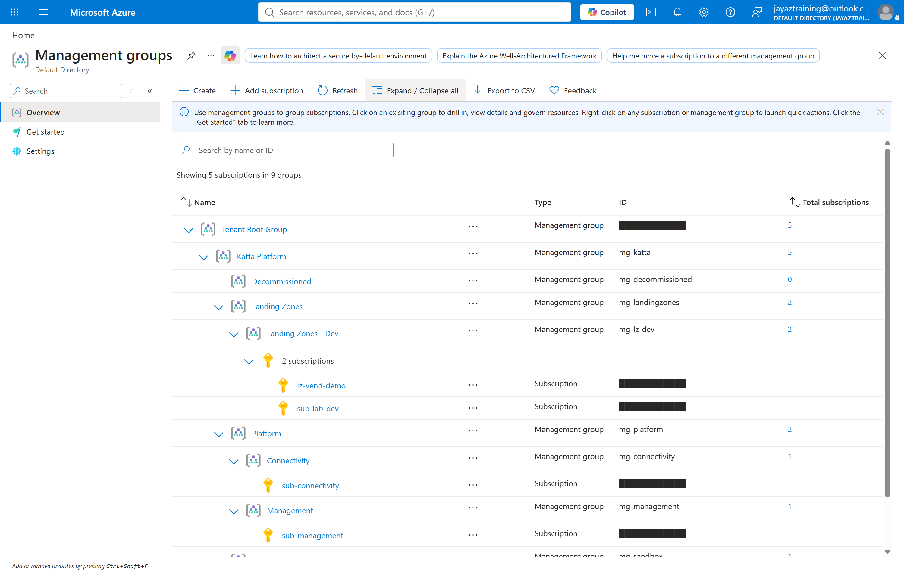
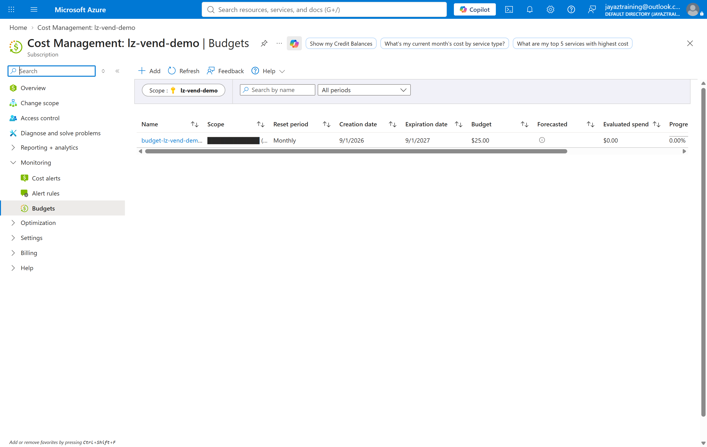
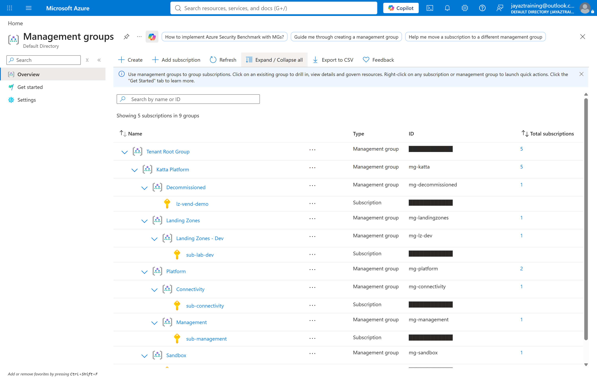

# Week 04 — Subscription vending

The bootstrap created three subscriptions by hand, one at a time, watching each
one. This turns that into a pipeline: a request goes in, and a landing zone comes
out created, placed, budgeted and granted, with no portal step.

The week's claim: **vending is easy and de-vending is not.** Creating a
subscription is four API calls. Getting rid of one is a three-day wait you cannot
shorten, and the interesting engineering is all on that side.

## Cost note

Nothing here has a per-hour price. A subscription costs nothing to exist, and a
budget and a role assignment are free. The bill is whatever gets deployed
*into* a landing zone, which is the next week's problem by design.

| Resource | Cost |
| --- | --- |
| Vended subscription | none, empty |
| Cost Management budget | none |
| Role assignment | none |

`scripts/cleanup.sh` destroys the payload. It cannot delete the subscription —
see **Teardown**, which is the most useful section of this README.

## How it fits together



## Vending is four operations across three APIs

Only the first creates anything you would call a subscription:

| | Operation | API | Measured |
| --- | --- | --- | --- |
| 1 | create | Subscription Alias | **2m16s** |
| 2 | place | Management Groups | 5s |
| 3 | budget | Consumption | 7s |
| 4 | grant | Authorization (RBAC) | 45s |

**Step 2 is the one that gets forgotten, and its absence is invisible.** The
alias API creates every subscription under the Tenant Root Group and does not
move it. A subscription created but never placed is billed correctly, reports
healthy, and inherits no policy and no role assignments from the tree it was
supposed to land in. Nothing looks wrong until something that should have been
stopped is not.

That is why placement is a separate Terraform resource here rather than an
attribute, and why `validate.sh` checks it from both directions — that the
management group lists the subscription, *and* that the subscription reports the
management group as its parent.

## Two stages, one payload

```bash
./scripts/deploy.sh config    # vend onto an existing subscription — repeatable
./scripts/deploy.sh vend      # create a subscription too — one-way
```

`config` is the default, and that default is deliberate: the destructive stage
should be the one you have to ask for. It vends steps 2–4 onto a subscription
that already exists, which is both the safe rehearsal and the realistic case —
a mature estate vends onto existing subscriptions far more often than it creates
new ones.

The payload is defined once and shared by both stages, so "what does a landing
zone get" has a single answer that cannot drift between the rehearsal and the
real thing.

## What was measured

`scripts/validate.sh` after the `vend` stage: **7 passed, 0 failed.**

| # | Check | Result |
| --- | --- | --- |
| 1 | Budget on every vended target | `25.0` on both the existing and the vended subscription |
| 2 | Grant at subscription scope | 1 Reader on each, at the subscription itself rather than inherited |
| 3 | Placement, from the management group's side | `mg-lz-dev` lists the vended subscription |
| 4 | Placement, from the subscription's side | parent = `/providers/Microsoft.Management/managementGroups/mg-lz-dev` |
| 5 | Drift | none |

## The deny-all is finally proven

`mg-decommissioned` has carried an enforcing deny-all since the bootstrap, and
it had never denied anything — the scope had no subscription in it, so there was
nothing to attempt. It was the one control in this lab asserted rather than
demonstrated.

With a subscription in scope, attempting to create a resource group:

```
(RequestDisallowedByPolicy) Resource 'rg-decomm-probe-001' was disallowed by
policy. Reasons: 'This subscription is decommissioned and is waiting out its
retention window. Nothing may be created in it. If you need these resources,
move the subscription out of the decommissioned management group first.'
```

The message is the one written into the policy at bootstrap, which is the point:
a deny is only useful if the person who hits it is told what to do next.

## Teardown

Two kinds of thing, and only one of them goes.

- **The payload** — budgets and role assignments. Ordinary resources,
  `terraform destroy` removes them. 6 destroyed.
- **The subscription** — cannot be deleted. Cancelling stops billing
  immediately, the Delete option does not appear for **three days**, and Azure
  removes it automatically only after **ninety**.

So cleanup for a subscription means *decommission*: move it out of the landing
zone tree into the group that refuses everything, prove that refusal, and cancel.

**The order matters, and this script had it wrong first time.** `terraform
destroy` on `azurerm_subscription` **cancels the subscription** — it does not
merely drop it from state. The alias destroy took 1m39s, and afterwards ARM
refused every write:

```
(ReadOnlyDisabledSubscription) The subscription ... is disabled and therefore
marked as read only.
```

A deny-all probe run after that never reaches policy evaluation. It is refused
for being cancelled, which proves nothing about the policy — and the explicit
cancel then fails too, with `NotAllowed — "Subscription is not in active state"`.
`cleanup.sh` now moves and probes first, and destroys last.

The probe's guard is worth keeping: it distinguishes a policy denial from any
other failure and refuses to claim success for the wrong error. A check that
reports "denied" because the request failed for an unrelated reason is worse
than no check.

## Evidence

| | |
| --- | --- |
|  | `lz-vend-demo` under **Landing Zones - Dev**. Decommissioned shows 0 |
|  | `$25.00` monthly on the vended subscription, 9/1/2026 – 9/1/2027 |
|  | After decommission: **Decommissioned shows 1**, holding `lz-vend-demo` |

## What this cost in surprises

- **`Azure/lz-vending` could not be used at all.** Microsoft's own vending
  module is the obvious choice and its inputs map exactly onto this week. Its
  `role_definitions` and `cached_data` submodules require
  `hashicorp/azurerm ~> 4.0`; this lab standardises on `~> 5.2`; the constraints
  have no overlap and `terraform init` refuses to resolve. 7.0.3 is the newest
  of its 37 releases and predates azurerm 5. Checked 2026-09-11 with azurerm at
  5.5.0. So the pipeline is written directly instead — which is a week-03 lesson
  arriving from the consumer's side.
- **DevTest is not available on an MCA Individual billing account.** The alias
  call is refused with `Code="NotAllowed"`, `InvalidSku`, and the message
  *"Can't create DevTest Azure plans for individual billing account."* Nothing
  in it names the offending field; the only hint is the word `Sku`. The outer
  error is `StatusCode=0`, which is the same signature as the timeout the
  bootstrap saw, so the obvious first guess is wrong. The bootstrap never hit
  this because it omits `workload` entirely and takes the Production default —
  being more explicit than the working code is what broke it.
- **A freshly vended subscription is invisible to the CLI.** `az` answers from a
  locally cached account list, so every query returns
  `Subscription '<guid>' not found. Check the spelling and casing` — which reads
  as "vending failed" when it plainly did not. `az account list --refresh` fixes
  it, and `validate.sh` now runs that first. Three checks reported failure
  against resources that existed.
- **`az account list` state lags ARM.** After the destroy, the subscription
  listed as `Enabled` while ARM refused writes on it as disabled. Trust the
  write path, not the list.
- **The budget window must be static.** A window derived from `timestamp()` is
  re-evaluated on every plan, so the budget reports drift forever against a
  resource nobody touched. A drift check that always fails is one nobody reads.
