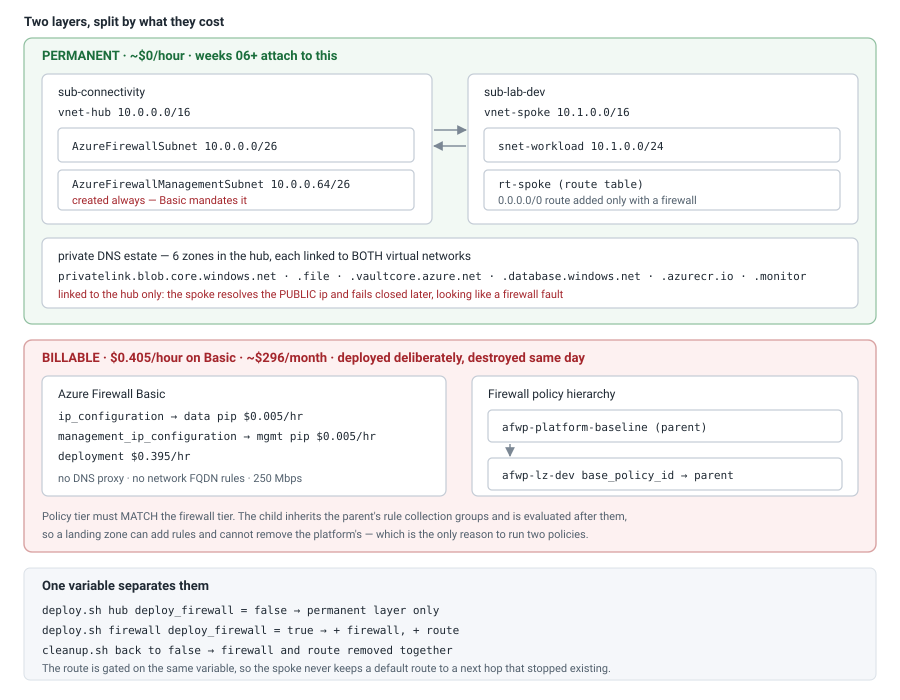
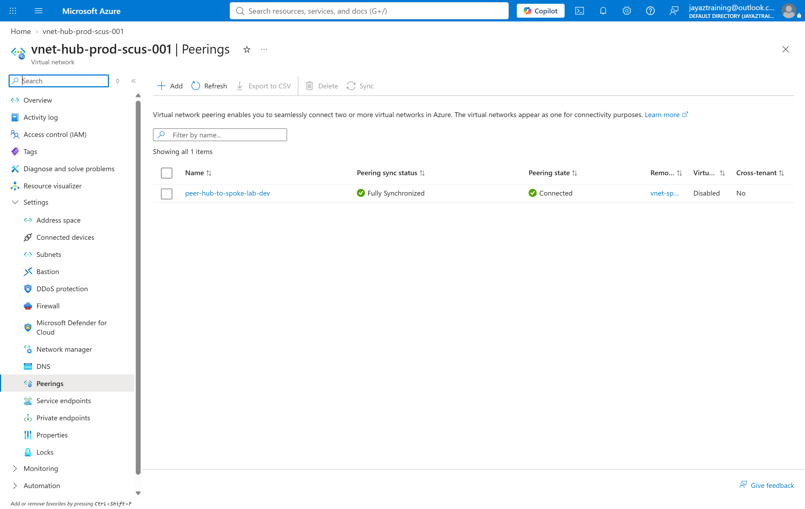
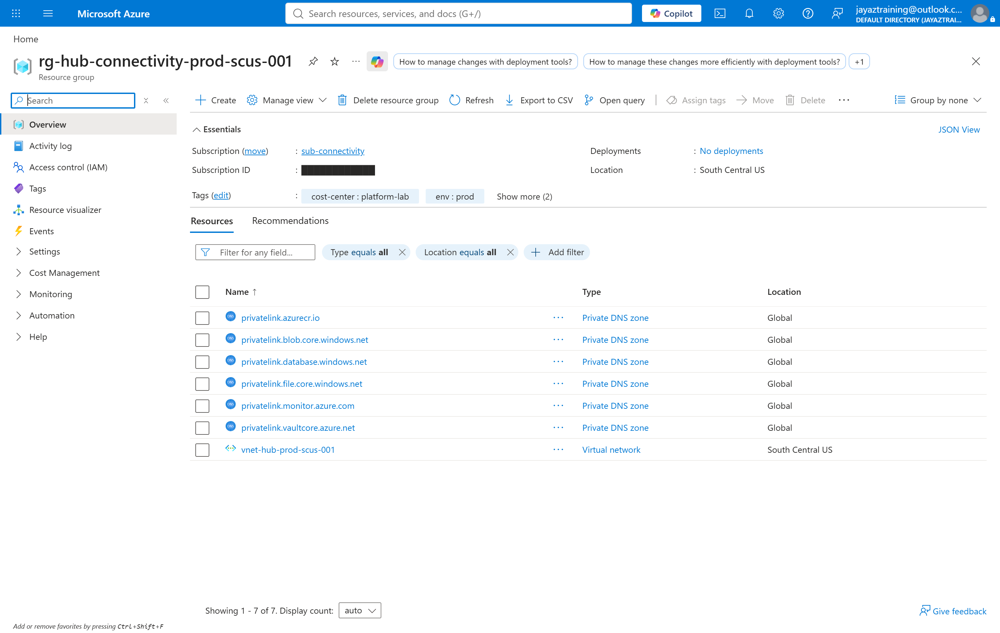
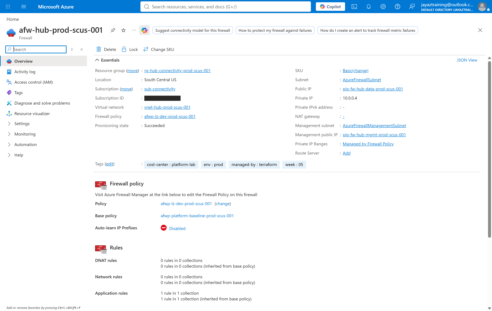
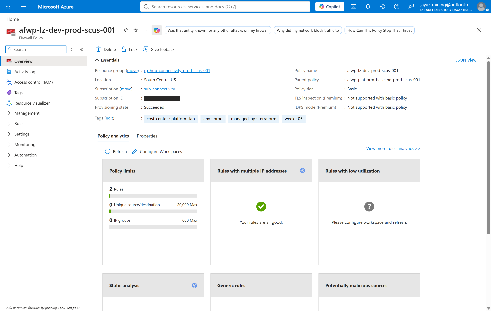
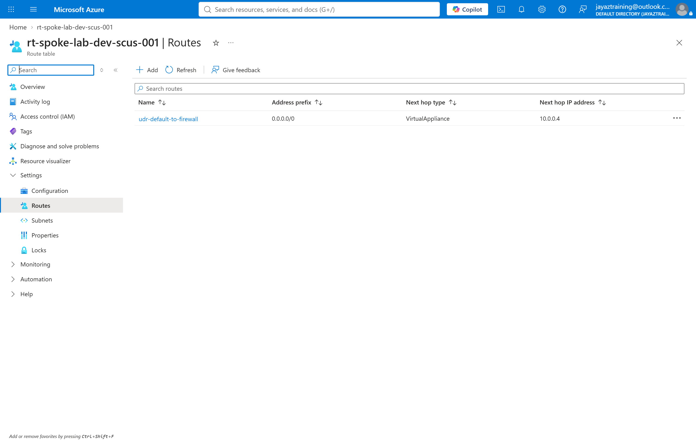

# Week 05 — The hub network

Everything later in this lab attaches to what is built here: spokes peer into
this hub, private endpoints resolve through this DNS estate, and egress leaves
through this firewall.

That makes the interesting decision the **lifecycle**, not the topology. A week
described in the roadmap as "built once, kept" cannot also be a week that bills
by the hour forever — so this one is split in two, and the split is the design.

## Cost note

| Layer | What is in it | Cost | Lifecycle |
| --- | --- | --- | --- |
| **Permanent** | hub VNet, both firewall subnets, spoke VNet, both peerings, route table, 6 private DNS zones and their 12 links | **~$0/hour** | stays up |
| **Disposable** | Azure Firewall Basic, 2 public IPs, 2 firewall policies | **$0.405/hour** | deployed deliberately, destroyed the same day |

Prices read from the Azure retail price API for `southcentralus` on 2026-09-19:
Basic deployment `$0.395/hour`, standard static public IP `$0.005/hour` each.
Basic requires two, so the floor is `$0.405/hour` — about **$296/month** if left
running. Standard would be `$1.325/hour`, about **$967/month**.

`deploy_firewall` defaults to **false** and `scripts/cleanup.sh` removes **only**
the firewall by default. That inverts the usual teardown on purpose: destroying
the hub by reflex would break the next six weeks to save nothing.

**What this week actually cost: $0.72.** The firewall ran 19:48–21:35 UTC,
1 hour 47 minutes, against a planned ~1 hour. Both causes were process, not
Azure, and both are written up under *What this cost in surprises*.

## How it fits together



## Built in this order

### 1. The hub, the spoke, and the peering between them

The hub lives in `sub-connectivity` and the spoke in `sub-lab-dev` — two
subscriptions, two providers, one configuration. That is what the bootstrap's
hierarchy is for, and this is the first week that proves the split earns its
keep: hub and spoke can be owned by different teams on different lifecycles.

**A peering is two resources, not one.** Each side is declared independently and
the link only carries traffic when both exist. One side alone sits in
`Initiated` — a resource that exists, reports healthy, and moves no packets. So
the check reads the *state*, not the existence.



### 2. The private DNS estate

Six `privatelink` zones, created in the hub and linked to **both** virtual
networks. The names are not arbitrary: each Azure service publishes the exact
zone its private endpoints register into, and a zone one character off resolves
nothing while looking entirely correct.

They live in the hub because a private endpoint must resolve to the same record
everywhere. Per-spoke zones are the classic mistake — resolution works in the
spoke that owns the endpoint and silently returns the **public** IP everywhere
else, which fails closed much later and looks like a firewall fault.



### 3. The firewall — and what Basic quietly requires



Basic is not simply a cheaper Standard. It **mandates a management NIC** — a
second subnet named `AzureFirewallManagementSubnet` and a second public IP,
neither of which Standard needs. That is a virtual network design decision, so
this hub creates the management subnet **unconditionally**, at every tier:
changing tier later is then a variable change rather than re-addressing a live
hub, and an empty /26 costs nothing.

Basic also has **no DNS proxy** ("uses Azure DNS only"), no network-level FQDN
filtering, no web categories, threat intelligence in alert mode only, and a
250 Mbps ceiling. Private endpoint resolution still works — the zones above are
linked per-VNet and resolve through Azure DNS — but the firewall cannot be the
central resolver for spokes.

### 4. The policy hierarchy



A parent policy holds what every landing zone gets and cannot remove; a child
inherits it and adds its own. Child rule collection groups are evaluated *after*
the parent's, so the parent always wins — which is the entire reason to run two.

The policy tier must **match** the firewall tier. The portal states the
consequence plainly: `TLS inspection (Premium): Not supported with basic policy`.

Note the firewall blade above reports `1 rule in 1 collection` **and**
`1 rule in 1 collection (inherited from base policy)`. That inherited line is
the hierarchy working, read from the firewall rather than from the template.

### 5. The route that makes it load-bearing



Without this, the firewall exists and carries nothing. The spoke's default route
has to point at it — `0.0.0.0/0 → VirtualAppliance → 10.0.0.4`, which is the
private IP shown on the firewall blade in step 3.

The route is gated on the same variable as the firewall, deliberately. A
`0.0.0.0/0` route to a next hop that no longer exists does not fail loudly; it
blackholes the subnet.

## What was measured

`scripts/validate.sh`, with the firewall deployed: **5 passed, 0 failed.**

| # | Check | Result |
| --- | --- | --- |
| 1 | Both peerings report `Connected` | hub → spoke and spoke → hub, both `Connected` |
| 2 | Every zone linked to both VNets | 6 zones, 12 links |
| 3 | Firewall subnets named and sized | `AzureFirewallSubnet 10.0.0.0/26`, `AzureFirewallManagementSubnet 10.0.0.64/26` |
| 4 | Spoke default route points at the firewall | next hop `10.0.0.4` = firewall `10.0.0.4` |
| 5 | Drift | none |

Without the firewall the same script reports **4 passed, 0 failed** and skips
check 4 — the absence of a `0.0.0.0/0` route is the correct state, not a gap.

## Running it

```bash
./scripts/deploy.sh hub        # permanent layer. ~$0/hour. Safe to leave
./scripts/validate.sh
./scripts/deploy.sh firewall   # + firewall and route. $0.405/hour. Billing starts
./scripts/validate.sh
./scripts/cleanup.sh           # removes the firewall, keeps the hub
./scripts/cleanup.sh --all     # removes everything, including the hub
```

## Teardown

`cleanup.sh` removes the firewall, both public IPs and both policies by
re-applying with `deploy_firewall=false` — not with `destroy -target`, which
would leave the route pointing at an address that no longer answers. Both are
gated on the same variable, so they go together in dependency order.

The public IPs matter more than they look. A standard static IP left behind is
`$0.005/hour` — trivial per hour and permanent if nobody checks — so the script
verifies that zero firewalls **and** zero public IPs remain before it reports
clean.

## What this cost in surprises

- **The teardown failed, and the script reported success.** The first
  `cleanup.sh` run died with
  `FirewallPolicyUpdateFailed — Put on Firewall Policy afwp-lz-dev... Failed
  with 1 faulted referenced firewalls`: Terraform tried to update the child
  policy while the firewall still referenced it. The firewall stayed up and kept
  billing, and the script **still exited 0**. It now checks the apply's exit code
  explicitly rather than trusting `set -e`.
- **The safety check could not run at all.** `cleanup.sh` verified with
  `az network firewall list`, which needs the `azure-firewall` extension and, in
  a non-interactive shell, dies on the dynamic-install prompt with
  `EOFError: EOF when reading a line`. So the check whose entire job was to catch
  a surviving firewall was itself incapable of running. This lab had already
  documented that failure mode for `az account subscription list` and it was
  reintroduced anyway. Now uses `az resource list`, which needs no extension.
  Recovery was `az resource delete --ids <firewall>`, 8 minutes, then a re-apply.
- **`az network vnet subnet show --query addressPrefix` returns null.** The value
  moved to `addressPrefixes[]`. Querying the old field returns empty, which is
  indistinguishable from "the subnet does not exist" — so both firewall subnets
  reported as missing when they existed and were correct. Read
  `addressPrefixes[0] || addressPrefix`.
- **azurerm 5.x changed the DNS link schema.**
  `azurerm_private_dns_zone_virtual_network_link` takes `private_dns_zone_id`;
  4.x took `resource_group_name` + `private_dns_zone_name`. Copying a link block
  from almost any published example fails validate on both arguments.
- **A billable resource left unattended is the real risk, not the hourly rate.**
  An hour of Basic is about $0.41. This week ran 1h47m because nothing was
  watching the meter between capture and teardown. The rate was never the
  problem; the absence of a deadline was.
