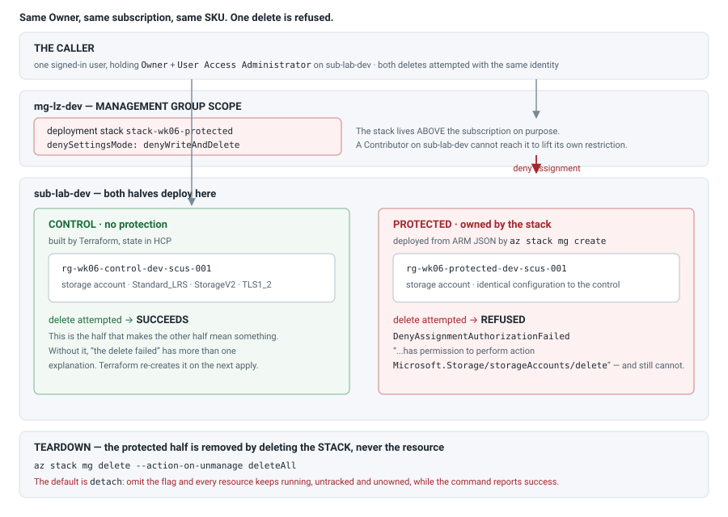
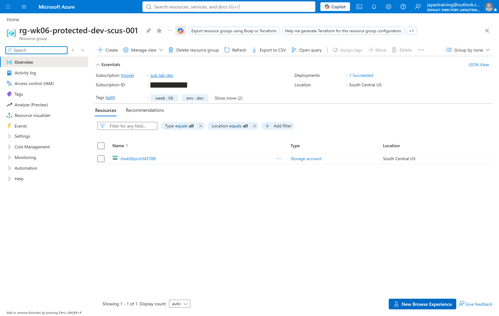
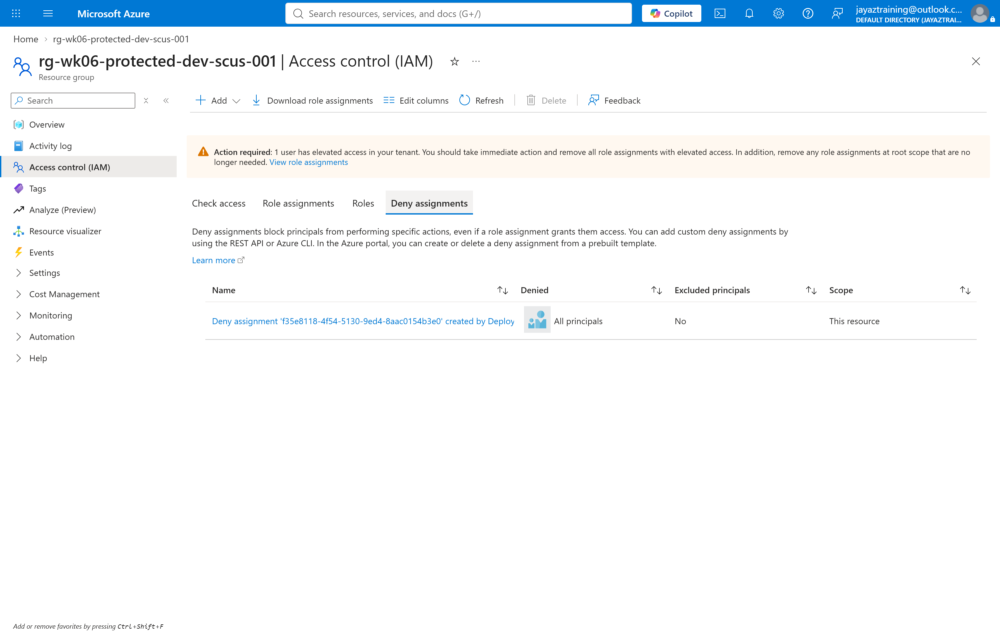

# Week 06 — Deployment stacks, and a deny that outranks the Owner

Every protection this lab has built so far can be removed by whoever it protects.
A resource lock is a resource: an Owner deletes the lock, then deletes the thing.
An Azure Policy `deny` effect is an assignment: an Owner unassigns it. The
protection and the target sit at the same scope, under the same identity, so the
control is only ever as strong as the discipline of the person subject to it.

A **deployment stack** breaks that. The stack owns a set of resources and holds a
**deny assignment** over them — and a deny assignment is not a role assignment.
It cannot be out-voted by a role. The caller in this week's test holds `Owner`
**and** `User Access Administrator` on the subscription, is told by Azure in the
error text that they *have* permission to perform the delete, and the delete is
refused anyway.

The week's claim, stated so it can fail: **an Owner with full rights over the
subscription cannot delete a resource a deployment stack is protecting, and can
delete an otherwise identical resource beside it.**

## Cost note

| What runs | Cost |
| --- | --- |
| 2 storage accounts, `Standard_LRS`, `StorageV2`, empty | **~$0/hour** |
| The deployment stack, the deny assignment, the resource groups | **free** |

Storage bills for capacity and transactions. These accounts hold nothing and
serve nothing, so the run cost rounds to zero — the meter that matters is the one
this week does *not* touch. Nothing here is left running: `scripts/cleanup.sh`
removes the stack, its managed resources and the Terraform half.

**What this week actually cost: $0.00.**

The interesting cost is not money. It is that a stack with deny settings on is
harder to remove than what it protects, which is the point and also the trap —
see *Teardown* below.

## How it fits together



## The design

### Two halves, two tools, and that split is deliberate

```
the control     Terraform, into sub-lab-dev. An ordinary storage account,
                no protection whatsoever.
the protected   an ARM template deployed as a deployment stack created at
                mg-lz-dev scope, into sub-lab-dev, deny settings on.
```

**Deployment stacks have no Terraform resource.** Checked on 2026-09-20 against
the azurerm provider's own documentation tree: there are `*_template_deployment`
resources, and nothing for `Microsoft.Resources/deploymentStacks`. Microsoft's
guidance says the same — *"To create and update a deployment stack, use the Azure
CLI, Azure PowerShell, or the Azure portal with Bicep files."* Terraform is not on
that list, so this week does not pretend otherwise. The stack is created by
`az stack mg create` and the template is ARM JSON, which needs no extra toolchain
and is what Bicep compiles to before the stack ever sees it.

The control is not decoration. Without it, *"the delete failed"* has more than one
explanation — a typo in the account name, a transient Azure error, a missing role.
With it, the two attempts differ in exactly one variable: same subscription, same
region, same SKU, same TLS floor, same public-access setting, same identity, one
held by a stack.

### The stack is scoped ABOVE the subscription it deploys into

The stack is created at **`mg-lz-dev`** — a management group — and deploys into
`sub-lab-dev`. That scope is the security control, not a detail.

A deny assignment lives where the **stack** lives. Put the stack in the
subscription and an Owner of that subscription can reach the stack, delete it, and
take the deny assignment with it. Put the stack a level up, and lifting the
restriction requires rights at the management group — which is a different grant,
held by different people, reviewed on a different cadence.

This is also why the stack creates its own resource group rather than deploying
into one Terraform made. **A resource with two owners has an ambiguous teardown**,
and an ambiguous teardown is precisely the failure this week is about avoiding.
The stack owns everything it protects, down to the resource group.

### `denyWriteAndDelete`, and the mode that is not quite it

`--deny-settings-mode` takes `none`, `denyDelete`, or `denyWriteAndDelete`. This
week uses `denyWriteAndDelete`, because `denyDelete` leaves a wide door open: a
protected storage account whose network rules can still be rewritten, whose public
access can be re-enabled, and whose TLS floor can be dropped is not meaningfully
protected — it just cannot be removed while being quietly ruined.

## What was measured

`scripts/validate.sh`, run 2026-09-25 against the live deployment. Five checks,
and check 3 genuinely deletes something:

```
control:   stwk06ctrl082142   (Terraform, unprotected)
protected: stwk06prot345788   (deployment stack, denyWriteAndDelete)

1. The stack exists at mg-lz-dev and reports its managed resources
   managed resources: 2   denySettings.mode: denyWriteAndDelete
   RESULT: the stack is managing resources with deny settings on

2. The managed resources report a deny status
   status=managed  denyStatus=denyWriteAndDelete
   status=managed  denyStatus=denyWriteAndDelete
   RESULT: 2 resource(s) carry denyWriteAndDelete

3. Deleting the CONTROL storage account succeeds
   RESULT: deleted - an ordinary account, deletable by an Owner

4. Deleting the PROTECTED storage account is refused
   RESULT: REFUSED by the stack's deny assignment
     DenyAssignmentAuthorizationFailed) The client '<signed-in user>' with
     object id '<oid>' has permission to perform action
     'Microsoft.Storage/storageAccounts/delete' ...

5. The refusal applied to an Owner, not a limited principal
   caller roles on the subscription: Owner User Access Administrator
   RESULT: the caller holds Owner and was still refused

── 5 passed, 0 failed ──
```

Read check 4's error text again. Azure is not saying the caller lacks permission —
it is saying the caller **has** it. The deny assignment is evaluated after the role
grant and overrides it. That single sentence is the whole week.

## Evidence






The deny assignment is listed in the portal under the subscription's **Access
control (IAM) → Deny assignments**, created by `Deployment stack`, with *Denied:
All principals* and *Excluded principals: No*. Nobody created it by hand and nobody
can edit it there — the stack is the only thing that changes it.

**The stack itself has no portal view at management group scope.** Opening it
returns *"This feature isn't implemented at this time."* Stacks at subscription and
resource group scope render; the management group blade does not, as of 2026-09-25.
That is a real constraint on operating them, not a gap in this week's evidence: the
deny assignment above and `az stack mg show` are the views that exist.

## Running it

```bash
cp terraform/terraform.tfvars.example terraform/terraform.tfvars
# fill in subscription_id, location, control_storage_account_name

./scripts/deploy.sh      # Terraform for the control, az stack mg create for the protected
./scripts/validate.sh    # tries both deletes and reports which one Azure refused
./scripts/cleanup.sh     # removes the stack, then the Terraform half
```

`deploy.sh` runs `az stack mg validate` before `az stack mg create`, because a
stack that fails midway still exists — and a half-failed stack *with deny settings*
is harder to remove than one that never started.

## Teardown

The protected resources cannot be deleted directly. That is the entire point, and
it means the teardown is not the usual one:

```bash
az stack mg delete --name stack-wk06-protected \
  --management-group-id mg-lz-dev \
  --action-on-unmanage deleteAll --yes
```

**`deleteAll` is not optional.** The documented default is *detach*: deployment
stacks detach and do not delete unmanaged resources. A teardown that omits the flag
deletes the stack, drops the deny assignment, and leaves every resource running —
unowned, untracked, still billing — while the command exits 0 and says nothing. On
this week that costs nothing. On a week with a firewall in it, that is the bill
that arrives a month later.

Three documented ways the delete can fail, all handled in `scripts/cleanup.sh`:

- **Permission.** Updating or deleting a stack whose deny setting is anything other
  than `none` needs rights at the stack's scope. *Deployment Stack Contributor*
  cannot do it; Owner at the management group can.
- **Stack out of sync.** The delete is refused rather than risk removing something
  unexpected. The bypass flag is deliberately not used — it deletes whatever the
  managed list happens to contain, which is exactly the situation the error exists
  to stop.
- **A resource group holding resources the stack does not manage** is not removed,
  and neither are those resources.

`cleanup.sh` therefore checks the delete's exit code explicitly and then **verifies
against Azure** that both resource groups are gone, rather than trusting a zero
exit. That is a direct correction from week 05, where a teardown reported success
while an Azure Firewall kept billing.

## What this cost in surprises

- **ARM rejects a top-level `"//"` member.** The convention of using `"//"` as a
  JSON comment key fails here with `InvalidRequestContent: Could not find member
  '//' on object of type 'Template'`. Commentary has to live in `metadata`, which
  is a real schema member.
- **`az stack mg validate` does not accept `--yes`; `az stack mg create` does.**
  Sibling commands, different argument sets, and the error is
  `unrecognized arguments: --yes`.
- **A marker file written by one script and read by another must agree on the
  directory.** `deploy.sh` wrote `.protected-storage-account` at the week root while
  `validate.sh` read `scripts/.protected-storage-account`, so validation reported
  *"run deploy.sh first"* against a deploy that had just succeeded.
- **Management-group-scoped stacks have no portal UI.** Plan to operate them
  entirely from the CLI, and plan the evidence for a change review accordingly.
