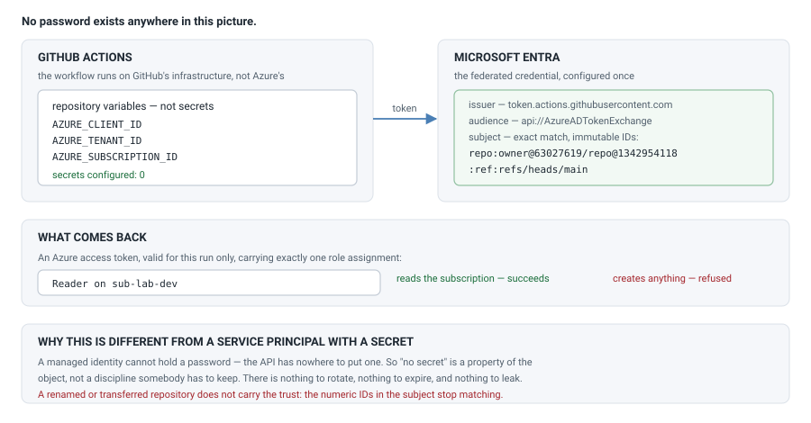

# Week 07 — A CI identity with no secret to steal

GitHub Actions deploys to Azure. Nothing in the repository is a credential.

The mechanism is **workload identity federation**: GitHub mints a short-lived
token describing the run, Azure checks it against a trust we configured once,
and hands back an access token. No password exists, so none can leak, expire,
or be forgotten in a repo.

## Cost note

| What runs | Cost |
| --- | --- |
| User-assigned managed identity, federated credential, role assignment | **free** |

**What this week cost: $0.00.** Nothing here bills.

## How it fits together



## What gets built

Four resources:

- **A user-assigned managed identity.** User-assigned is forced, not chosen —
  federation does not work with a system-assigned identity, because there is no
  Azure resource here to own one. The workload runs on GitHub's infrastructure.
- **A federated credential** naming the issuer, the audience, and the subject.
- **A Reader role assignment** at subscription scope.
- The resource group holding them.

### The subject is the security boundary

```
repo:katta698@63027619/Azure-Platform-Engineering-Lab@1342954118:ref:refs/heads/main
```

It is **exact-match, not a prefix**. A different repository, or the same
repository on a different branch, presents a different subject and is refused —
which is why a fork raising a pull request cannot obtain this identity.

Those numeric IDs are not decoration. GitHub now defaults to **immutable subject
claims**, embedding the owner ID and repository ID so that renaming or
transferring a repo does **not** carry the Azure trust with it. It also means the
documented `repo:owner/repo` form is no longer what a runner presents, so the
deploy reads the real prefix from GitHub rather than building the string:

```bash
gh api repos/{owner}/{repo}/actions/oidc/customization/sub --jq '.sub_claim_prefix'
```

### Reader, not Contributor

This week's workload reads. Granting Contributor "so it works later" is how a CI
identity quietly becomes the most powerful principal in a tenant. The workflow
proves the limit by attempting a resource group create and expecting refusal.

## Running it

```bash
cp terraform/terraform.tfvars.example terraform/terraform.tfvars
# fill in tenant_id, subscription_id, github_org, github_repo

./scripts/deploy.sh      # reads the subject prefix from GitHub, then applies
./scripts/validate.sh    # 5 checks against the live identity
./scripts/cleanup.sh     # destroys everything and verifies against Azure
```

`deploy.sh` prints three identifiers. They go into GitHub as repository
**variables** — Settings → Secrets and variables → Actions → *Variables*:

```
AZURE_CLIENT_ID  AZURE_TENANT_ID  AZURE_SUBSCRIPTION_ID
```

Variables, not secrets. They are identifiers; knowing them grants nothing
without a token GitHub will only mint for this repo on this branch. A repo with
three variables and zero secrets is the week in one screen.

## What was measured

`scripts/validate.sh`, run 2026-09-29 against the live deployment:

```
1. The managed identity exists
   RESULT: present, client ID resolved

2. Exactly one federated credential, correctly configured
   count=1  issuer=https://token.actions.githubusercontent.com
   audience=api://AzureADTokenExchange
   RESULT: one credential, GitHub as issuer, Entra token exchange as audience

3. The subject names this repo and branch exactly
   RESULT: matches repo:katta698@.../Azure-Platform-Engineering-Lab@...:ref:refs/heads/main

4. There is no secret to steal
   password credentials on the identity's service principal: 0
   RESULT: none - authentication is a federated token, minted per run

5. The role is Reader, and only Reader
   roles: Reader
   RESULT: Reader alone - it can look, and cannot change anything

── 5 passed, 0 failed ──
```

Check 4 is the claim. A managed identity **cannot** hold a password — the API has
nowhere to put one. That is the difference from an app registration, where "no
secret" is a discipline somebody has to keep rather than a property of the object.

And the workflow itself, on a real runner:

```
client id  : f8bfdca3-...          <- a variable, not a secret
secrets    : none configured for this repo

── who am I ──
Subscription    Tenant
sub-lab-dev     29a908ac-...

── what can I see ──
rg-wk07-identity-dev-scus-001

── what I cannot do (Reader, deliberately) ──
refused, as designed - this identity reads and nothing more
```

## What this cost in surprises

**The first run failed at login, not at apply.** `AADSTS700213: No matching
federated identity record found for presented assertion subject`. The Terraform
had applied cleanly; the credential was simply built from the documented
`repo:owner/repo` form while GitHub, with immutable subject claims on, presents
numeric IDs. A credential that looks correct and matches nothing. Reading
`sub_claim_prefix` from GitHub fixes it permanently.

**A new HCP workspace defaults to remote execution**, so the plan ran on HCP's
servers and failed with `az: executable file not found in $PATH`. That reads
exactly like a local PATH problem, and it is not — there is no Azure CLI on
HCP's runners, and no credentials there either. Set the workspace to local
execution and it applies first time.

**azurerm 5.x changed `azurerm_federated_identity_credential`.** It takes a
single `user_assigned_identity_id` where 4.x took `resource_group_name` plus
`parent_id`, so every example predating the 5.0 release fails on all three
arguments at once.

## Security

- **No secret exists**, rather than no secret being committed. The object cannot
  hold one.
- **Tokens are minted per run** and are short lived, so there is no rotation
  schedule to forget.
- **The trust is pinned to one repo and one branch**, exact-match, with immutable
  IDs so a rename cannot carry it.
- **Reader only**, and the workflow asserts the limit rather than assuming it.
- `permissions: id-token: write` is required in the workflow, or GitHub never
  mints a token at all — and the resulting error points at Azure rather than at
  the workflow.

## Teardown

```bash
./scripts/cleanup.sh
```

Everything belongs to Terraform, so `destroy` removes the lot. The script then
checks Azure directly that the resource group is gone, rather than trusting an
exit code — and reports any role assignment left pointing at a principal that no
longer exists.
