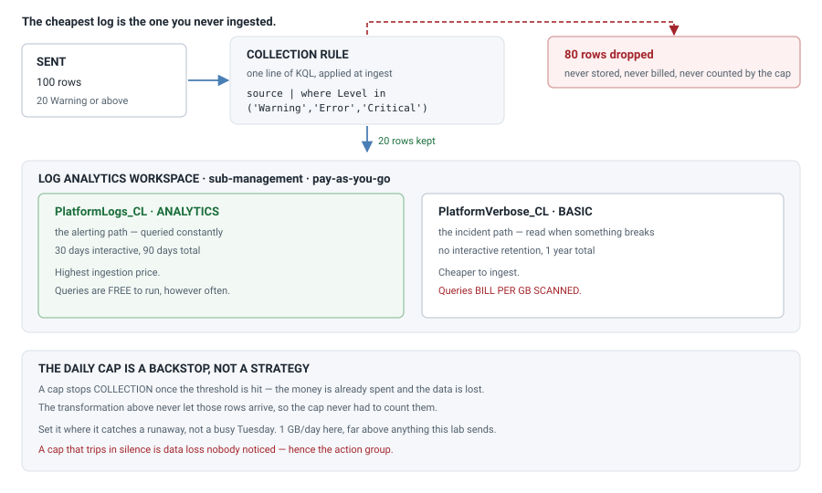
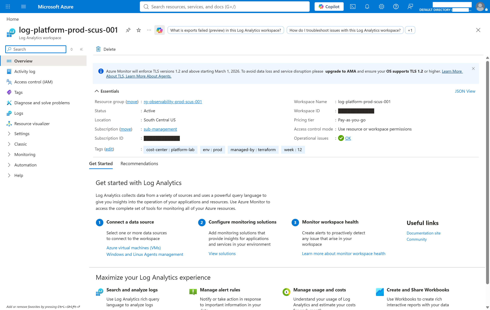
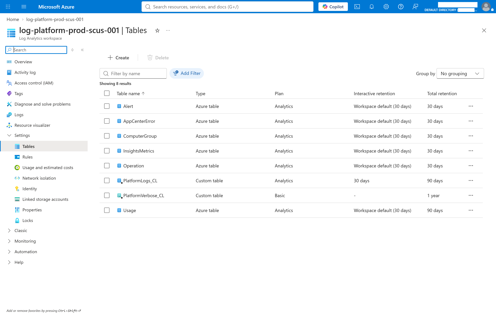
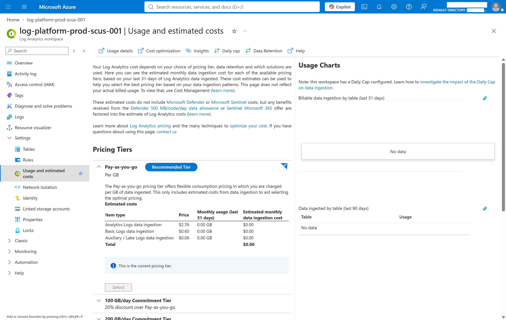

# Week 12 — Log Analytics, designed around what it costs

The workspace every later week sends logs to. Ingestion is the largest surprise
bill in Azure, so the design decisions here are cost decisions, made on purpose
rather than left at their defaults.

**The claim:** the cheapest log is the one you never ingested. Measured —
**100 rows sent, 20 stored, 80 dropped before they were ever billed.**

And the two levers compound. Dropping 80% of rows at ingest, then putting what
survives on the right plan, is the difference between paying $2.76 a GB for
everything and paying $2.76 for the fifth you actually query.

## Cost note

| What runs | Cost |
| --- | --- |
| The workspace itself, idle | **$0** — you pay for ingestion and retention, not existence |
| Ingestion | pay-as-you-go per GB, by table plan |
| This week's measured ingestion | **under 1 MB → $0.00** |

**This week stays up.** Weeks 13–16 send their data here, and an idle workspace
costs nothing. `cleanup.sh` refuses without `--force` for that reason.

Commitment tiers start at **100 GB/day**, and the portal puts that first tier at
**20% off** pay-as-you-go. A lab never reaches it, so pay-as-you-go is correct
here and the discount is not claimed.

## How it fits together



## The three decisions

### 1. Table plans follow how data is USED, not how big it is

Prices read from this workspace's own Usage and estimated costs blade, not from
a pricing page:

| Plan | Per GB ingested | Queries | Interactive window |
| --- | --- | --- | --- |
| **Analytics** | **$2.76** | **free to run** | up to 2 years |
| **Basic** | **$0.60** | **bill per GB scanned** | fixed 30 days |
| **Auxiliary / Lake** | **$0.06** | **bill per GB scanned** | full retention |

That is a **46x spread** between the most and least expensive plan. Moving one
table from Analytics to Basic cuts its ingestion cost by **78%**; to Auxiliary,
by **98%**.

So a cheap table queried often can cost more than an expensive one queried
rarely. That is the decision, and it is not about volume.

- `PlatformLogs_CL` → **Analytics**. The alerting path. Queried constantly, so
  it has to be fast and free to query.
- `PlatformVerbose_CL` → **Basic**. Read during an incident and almost never
  otherwise. The 30-day interactive window is acceptable *because* nobody
  browses month-old verbose logs by hand.

### 2. The daily cap is a backstop, not a strategy

Microsoft's own guidance says a daily cap "should not be used as a primary
mechanism to filter or reduce data". When it trips, **collection stops and the
data is gone** — the money is already spent and you have lost the logs too.

It is set at **1 GB/day**: far above anything this lab sends. A cap set near
normal volume trips on a normal busy day.

A cap that trips in silence is a data-loss incident nobody noticed, so an action
group is wired to it.

### 3. The transformation is the actual control

One line of KQL, applied at ingest:

```kql
source | where Level in ('Warning','Error','Critical')
```

Rows below Warning are never written, never stored, never billed — the cap never
has to count them, because as far as the bill is concerned they never arrived.

## Security

- **Resource-only permissions.** Reading a resource's logs needs no grant on the
  workspace. The alternative, workspace Reader, hands over every log from every
  subscription at once.
- **Shared keys off.** The workspace ID and key pair is a password that never
  expires, gets copied into config files, and records nothing about who used it.
  Callers authenticate with Entra tokens instead — week 07's lesson, applied.
- **Monitoring Metrics Publisher scoped to the DCR**, not the resource group.
  The role permits writing telemetry; getting it wrong means someone forging
  logs, so it is granted exactly where it is used.

## Running it

The HCP workspace is created **first, deliberately**, with its execution mode
set — not left for `terraform init` to create as a side effect:

```bash
# 1. the HCP workspace, with execution-mode local
#    (week 07 learned this the hard way - see below)

cp terraform/terraform.tfvars.example terraform/terraform.tfvars
# fill in tenant_id, subscription_id (sub-management), alert_email

./scripts/deploy.sh      # registers two providers, then applies
./scripts/validate.sh    # 5 checks; #4 sends 100 rows and counts survivors
./scripts/cleanup.sh     # refuses - this week stays up. --force to mean it
```

## What was measured

`scripts/validate.sh`, run 2026-10-05 against the live deployment:

```
1. The workspace exists, pay-as-you-go, with a cap
   sku=PerGB2018  daily cap=1.0GB  retention=30d
   RESULT: pay-as-you-go with a cap set

2. The table plans are what was asked for
   PlatformLogs_CL -> Analytics (wanted Analytics)
   PlatformVerbose_CL -> Basic (wanted Basic)
   RESULT: both tables on their intended plans

3. The collection rule and its endpoint are live
   RESULT: endpoint and rule both resolved

4. The transformation drops rows BEFORE they are billed
   sending 100 rows, 20 of them Warning or above
   ingestion API returned HTTP 204
   rows stored: 20 of 100 sent
   RESULT: 20 stored, 80 dropped at ingest and never billed

5. The cap has an alarm on it
   RESULT: an alert path exists

── 5 passed, 0 failed ──
```

Check 4 is the week. A transformation that filters nothing looks identical in
the portal to one that filters everything — the only way to know is to send
known data and count what survived.

## Evidence







Azure's own numbers, from this workspace: Analytics $2.76/GB, Basic $0.60/GB,
Auxiliary $0.06/GB, and a note confirming the daily cap is configured.

The Tables blade is the clearest view of the design: two custom tables on
deliberately different plans, next to every built-in table sitting on the
Analytics default.

## What this cost in surprises

**A plan cannot be set on a table that does not exist.** Setting
`AzureDiagnostics` to Basic failed with `ResourceNotFound`. A new workspace has
no built-in tables — they materialise the first time data of that type arrives,
which is *after* the point you would want the cheap plan in place. Hence custom
tables, created with `azapi` because `azurerm_log_analytics_workspace_table`
takes a name and a plan and has nowhere to put a **schema**.

**The DCR failed with a bare `InvalidPayload`** naming nothing at all. Same root
cause: its destination tables did not exist yet. A `depends_on` fixed it.

**Ingestion returns 403 until RBAC propagates.** Measured: ten attempts over
**five minutes**, then 204. Nothing in the deploy hints that waiting is required.

**The Usage table updates hourly**, so billable volume cannot be verified
immediately after a test. The row counts are instant; the cost figures are not.

**An `az` extension prompt corrupted a check.** `az monitor log-analytics query`
lives in an extension; without it, az asks "Do you want to install it now?" and
in a non-interactive shell the *prompt text* lands in the variable. Week 05 lost
a teardown to the identical trap with `az network firewall list`.

## Teardown

```bash
./scripts/cleanup.sh --force
```

Refuses without the flag. The workspace is **soft-deleted for 14 days** and its
name stays reserved, so rebuilding inside that window fails on a name conflict
unless you recover rather than re-create:

```bash
az monitor log-analytics workspace recover -g rg-observability-prod-scus-001 \
  -n log-platform-prod-scus-001
```
